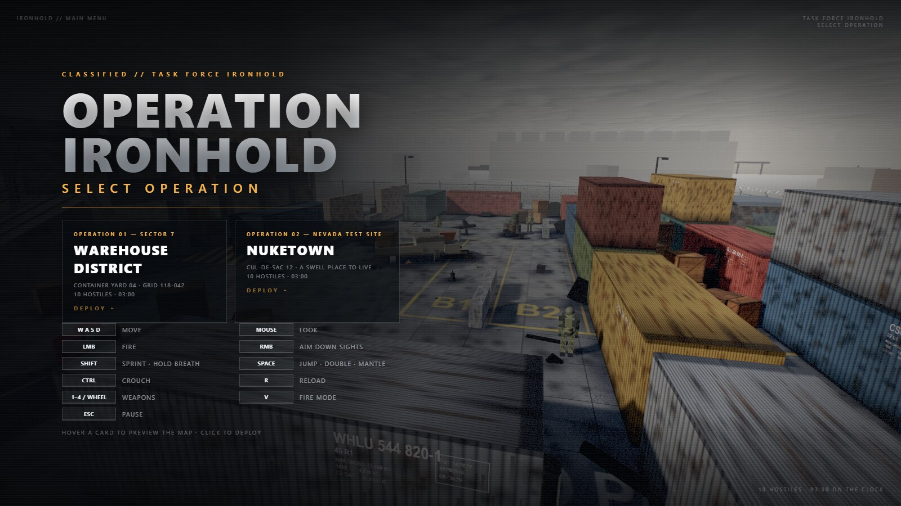
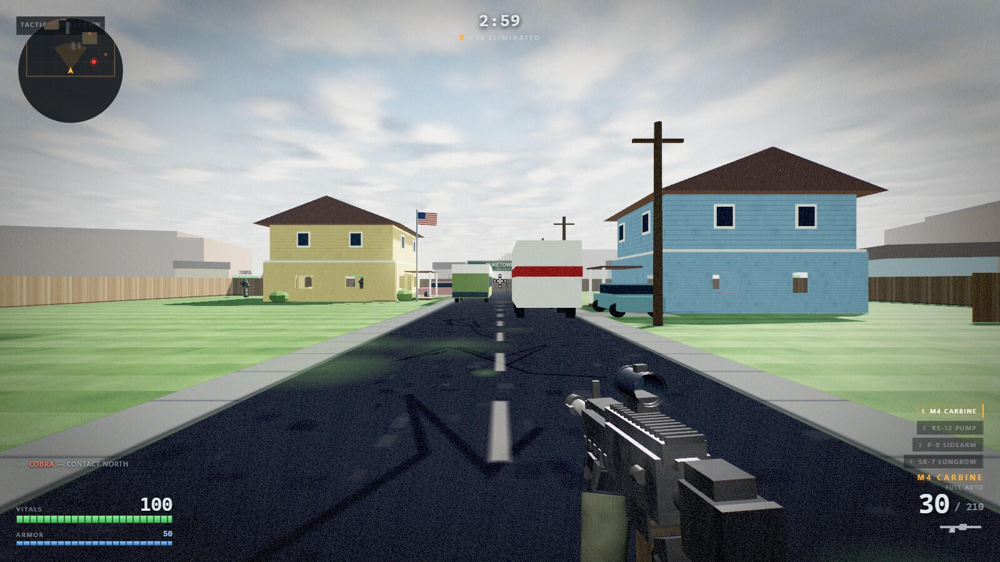

# 全面战线（Total Frontline）

A complete first-person shooter that runs in a browser tab. The game is authored in
TypeScript, compiled to one browser script, and has no package manager at runtime.

**[Play it here](https://vibeapps.lumigrav.space/total-frontline/)**


Pick an operation from the main menu: fight through the container yard in Sector 7,
or a 1950s cul-de-sac on the Nuketown test site. Either way it's a ten-minute
deathmatch with respawns on both sides.

The entire game — renderer setup, world generation, weapon handling, enemy AI, audio
synthesis, post-processing and HUD — is about 11,200 lines of TypeScript in `src/`.
The TypeScript compiler preserves the legacy load order in a single `dist/js/game.js`;
there is no application bundler or module runtime. The only external runtime resource
is three.js r128, pulled from a CDN. Everything else is generated at runtime.

It was built by an AI agent from seven prompts, recorded verbatim in
[PROMPTS.md](PROMPTS.md).

## Running it

Install the development dependencies and build the static output:

```bash
bun install
bun run build
```

Then serve `dist/`:

```bash
bun run serve
```

Then visit `http://127.0.0.1:8123/index.html`.

Click the page to start. The click is what grants pointer lock, so the game cannot capture
your mouse until you ask it to. Press `Esc` to release the pointer and pause, then click
the overlay to resume.

Requires a desktop browser with WebGL and Pointer Lock. There is no touch input, so it
will not play on a phone.

## Controls

| Input | Action |
| --- | --- |
| `W` `A` `S` `D` | Move |
| Mouse | Look |
| Left click | Fire |
| Right click | Toggle aim down sights |
| `R` | Reload |
| `Shift` | Sprint, or hold breath while scoped |
| `Ctrl` | Crouch |
| `Space` | Jump; tap again in the air to double jump; hold near a ledge to mantle |
| `1` `2` `3` `4` `5` | M4 carbine / KS-12 pump / P-9 sidearm / SR-7 Longbow / SAW-250 LMG |
| `6`–`0` | Fire readied killstreaks, in the order they were earned |
| `V` | Toggle the rifle between full auto and semi |
| Mouse wheel | Cycle weapons |
| `Esc` | Pause |

## The round

Ten-minute deathmatch. You start with 100 health and 50 armor; armor absorbs half of
incoming damage until it is gone, and health knits back up after 4.5 seconds out of the
line of fire. Dying costs 2.6 seconds — you redeploy at your spawn with a fresh loadout
and two seconds of protection — and fallen hostiles are replaced the same way. When the
clock runs out, more eliminations than deaths wins.

On Nuketown both sides spawn like the original: you behind the west house, the squad
behind the east one. On either map, hostiles hold fire for the first three seconds so
you can get your bearings, and a combat director caps the number shooting at you at any
one moment to two. The rest keep manoeuvring. That single constraint is what keeps a
firefight readable instead of collapsing into crossfire you cannot answer.

The report screen shows eliminations, deaths, headshots and accuracy.

You do not fight alone. Three squadmates — 磐石, 猎鹰, 流星 — hold a loose wedge off
your shoulder, pick their own targets (and get picked: hostiles engage them too), and
redeploy eight seconds after going down. Killstreaks are earned at 3, 5, 7, 8, 10 and
12 consecutive kills and dock on the left of the HUD — yours to fire with `6`–`0`
whenever the moment is right. The ladder: a UAV that paints every hostile on the
minimap for 25s, an airstrike walked onto the thickest enemy cluster, an EMP that
paralyses enemy fire for 12s, an attack helicopter strafing from its orbit for 40s,
a gunship circling with explosive fire for 25s, and the juggernaut suit — 300 armour
and small-arms resistance until you go down. Dying resets the count but keeps whatever
you had already earned.

## Weapons

| Slot | Weapon | Magazine | Reserve | Behaviour |
| --- | --- | --- | --- | --- |
| 1 | M4 Carbine | 30 | 210 | 760 rpm full auto, `V` switches to semi |
| 2 | KS-12 Pump | 8 | 48 | Nine pellets per shell, pump between shots |
| 3 | P-9 Sidearm | 15 | 90 | 430 rpm semi automatic, fastest draw |
| 4 | SR-7 Longbow | 5 | 25 | Bolt action, a body hit kills |
| 5 | SAW-250 LMG | 100 | 200 | 800 rpm full auto, slow to aim, long reload |

Each carries a viewmodel built from primitives with gloved hands, sways against mouse
movement, bobs in time with footsteps, dips off screen to reload and ejects brass that
bounces off the concrete. Muzzle flash is a sprite backed by a real point light that the
bloom pass picks up. The rifle climbs on a fixed recoil pattern rather than random scatter,
so the spray is something you can learn to hold down.

## Aiming


Right click toggles ADS. Every weapon settles in a fraction of a second (0.2s, 0.32 for
the LMG), tightens its spread, and costs 40% of your movement speed while held.

| Weapon | FOV | Zoom | Sight |
| --- | --- | --- | --- |
| M4 Carbine | 75 to 38 | 2.2x | Red dot on tinted glass |
| KS-12 Pump | 75 to 60 | 1.3x | Bead raised clear of the heat shield |
| P-9 Sidearm | 75 to 50 | 1.7x | Three-dot irons with an open notch |
| SR-7 Longbow | 75 to 15 | 5.8x | Scope overlay, mil-dot reticle |
| SAW-250 LMG | 75 to 48 | 1.6x | Aperture rear with a hooded post |

The sniper is the one that changes the screen. Scoping swaps the crosshair for a full
overlay and hides the weapon behind the glass, which the composite shader veils the way
real optics do. The view drifts on a slow two-sine sway; holding `Shift` steadies it for
three seconds, after which you have to release and take another breath. Mouse sensitivity
scales with the zoom so your aim stays consistent on screen. The bolt takes 1.5s to work,
which makes a miss genuinely expensive.

## Movement

Container tops, crates, barrel stacks, the wrecked flatbed and every other solid prop are
walkable. A jump clears roughly 1.2m and the double jump adds another 0.9m. Holding `Space`
while airborne near a ledge up to about 1.95m above your feet pulls you up over it, which is
what gets you onto a container roof from flat ground and onto the sniper deck without the
ramp.

## Enemies

Ten soldiers patrol waypoints, routing around cover with a grid pathfinder over the same
colliders the player obeys. Spotting you takes a human 300 to 800ms before they react, and
they call it over the radio when they do.

In a fight they break for cover, strafe, flank, reload, and refuse to fire when their muzzle
is blocked even if they can see you over it. Line of sight is traced from the player's end
as well as theirs, which guarantees the two agree: if you cannot shoot them, they cannot
shoot you. Headshots do double damage, hits produce a flinch, and death drops them in a
ragdoll fall with the weapon coming loose.

## Everything is generated at runtime

There are no image, audio or model files anywhere in this repository.

Concrete, corrugated steel, plywood, rust, brick and chain link are painted into canvases at
load, down to the stencilled shipping marks on the container flanks. Weapons, hands and
soldiers are assembled from boxes, cylinders and spheres. The sky is evaluated per fragment
and the industrial skyline on the horizon is geometry.

Every sound is synthesised through the Web Audio API: per-weapon gunshots layered from a
crack, a body and a chest thump, reloads, footsteps, impact sounds that differ between wall
and flesh, the low-health heartbeat, and an ambient industrial hum with distant metal creaks
on a random timer. There is a convolution reverb built from a generated impulse response.



## The maps

**Warehouse District** (Sector 7) — the original container yard: a two-story
warehouse with a sniper deck, container canyons, and a burnt-out flatbed in the
open centre.

**Nuketown** (Nevada Test Site) — a 1950s cul-de-sac: two pastel tract houses you
can fight through (or mantle onto the porch roofs), a bus and a moving van stalled
mid-street, wooden fences, backyards with a picnic table and a swing set, and
desert mesas past the picket line. Bright midday sun instead of the yard's haze.



The two maps are independent builds captured into swappable records by the map
registry (`src/10-map-registry.ts`): colliders, raycast targets, walkable grids,
patrol routes, cover anchors, sun/sky/fog and the menu camera all follow the
selected map. Hovering a menu card previews the map live behind the menu.

## Performance

Dynamic resolution scaling watches frame times and adjusts render scale to hold the target
frame rate. Repeated props are drawn with `InstancedMesh` grouped by colour. Static scenery
is merged into single draw calls. Tracers, decals, shell casings and particles are pooled.
Shadow casting is trimmed by bounding-box size, which cut roughly two thirds of the shadow
pass for objects that only ever contributed a sub-pixel smudge.

## Implementation notes

Six things are worth knowing before modifying the game files.

**No environment map.** three.js renders a metal with nothing to reflect as near-black, so
every material stays close to dielectric (`metalness` under about 0.2) and fakes metal
through colour and roughness instead. Raising `metalness` on the containers or weapons will
make any surface turned away from the sun collapse to black.

**Colour space is handled manually.** The renderer stays in linear output and the composite
shader does its own gamma encode, so material colours are pushed through
`convertSRGBToLinear()` at startup by `linearizeMats()`. New materials need the same
treatment or they will read oversaturated.

**Post-processing is hand-rolled.** The r128 CDN build has no `EffectComposer`, so bloom,
chromatic aberration, vignette, colour grading, damage tint and the low-health pulse all
live in one composite pass over a pair of render targets. Shadow tinting there is
multiplicative on purpose; an additive lift in linear space swamps near-black pixels and
turns the whole frame blue.

**The sky is a shader, and it has to be.** It began as a 4096x2048 equirectangular canvas,
which sounds like plenty until you do the arithmetic: 4096 texels over 360 degrees is 11
texels per degree, and the sniper's 15 degree field of view puts about 170 of them across a
1920 pixel screen. Eleven screen pixels per texel. Doubling the sheet buys one stop and costs
64MB, and it does nothing about the other half of the problem, which is that an equirect
projection collapses every column onto the zenith and smears whatever is painted up there
into a pinwheel. The replacement evaluates a gradient, a cloud deck and a cirrus layer per
fragment, so the scope magnifies ray directions instead of a bitmap. Clouds are projected
onto a flat slab overhead (`dir.xz / dir.y`), which bunches them towards the horizon the way
perspective actually does and makes the zenith an ordinary point of the plane rather than a
singularity. The fbm is band-limited against `fwidth` of that projection: octaves finer than
the fragment footprint are dropped rather than sampled, which is what stops the deck from
aliasing into a shimmer near the horizon where the slab stretches a degree of sky across
hundreds of noise cells. It measures free against a flat colour, because the dome is drawn
last of the opaque queue and early-z kills every sky fragment behind a wall.

**Sight alignment is data, not guesswork.** Each viewmodel returns an `adsPos` that puts its
sight on the viewmodel camera's -Z axis: `x` is zero and `y` is the negative of the sight's
height in model space. Move a sight and that number has to move with it. Optics you look
*through* need open-ended geometry with a double-sided material, since a capped cylinder
renders as a solid disc.

**The viewmodel is deliberately telephoto.** `VM_FOV` is 41.9 against the world's 75, and
every weapon sits proportionally further from the eye to hold its screen size. The two
numbers are a pair: narrowing the lens without pushing the gun out shrinks it, and pushing
it out without narrowing the lens makes it tiny. What the pairing buys is a flatter depth
gradient, so the buttstock stops ballooning over the receiver. `adsRef` is the sight's
distance from the eye and feeds the ADS dolly, so it scales with `adsPos.z`; `adsPos.x` and
`.y` do not, because sight alignment is independent of range.

Two smaller conventions: walkable surfaces are opt-out, since `box()` pushes anything solid
into `groundMesh` and `groundAt()` only considers surfaces at or below the probe height. And
the crosshair is drawn to a canvas rather than built from HTML elements, because at two
pixels thick every edge has to land on a whole device pixel or it smears.

## Repository layout

```
index.html                  markup, CSS, and the compiled game script tag
src/                        TypeScript game source in execution order (00 → 26)
  00-core.ts … 04-sky.ts    helpers, audio synth, renderer/post chain, textures, sky
  05 … 09                   Warehouse District: geometry, clutter, skyline
  10-map-registry.ts        the map swap: captureMap/applyMap + per-map environments
  11 … 12                   Nuketown: piece builders, ground, backdrop, assembly
  13 … 26                   queries, FX, viewmodels, weapons, enemies, HUD, input,
                            shooting, AI, movement, game flow, main loop
types/legacy-globals.d.ts   migration bridge for the three.js browser global
tsconfig.json               ordered TypeScript compilation into dist/js/game.js
tools/test-harness.js       collision, weapon and AI test suite (part 1)
tools/test-harness-combat.js enemy watchdog and movement probes (load after part 1)
tools/autoplay-bot.js       pathfinding bot for unattended regression runs
scripts/check-file-lines.mjs  the 600-line gate
scripts/smoke.mjs           headless-Chrome smoke test (menu, map swap, deploy)
```

The two files in `tools/` are development-only, as is everything in `scripts/`.
None of them are referenced by `index.html`; the harness is pasted into the console
or injected over the DevTools protocol. The harness exposes collision audits, weapon
accuracy and hit-fidelity tests, map boundary probes and an enemy watchdog. The bot
plays full rounds on its own with configurable aim error and reaction delay, which is
how the collision and AI fixes were regression tested.

## Development

One-time setup:

```bash
bun install
bunx lefthook install
```

Build and validate with:

```bash
bun run typecheck
bun run build
bun run check
```

Conventions are enforced by a pre-commit hook (lefthook → lint-staged → biome):

- **Biome** formats and lints every staged `.ts`/`.js`/`.json` file (`biome.json`).
  The migration-stage game files share one global lexical scope, so the
  lint rules that need cross-file knowledge (`noUnusedVariables`, `useConst`, …)
  are switched off — they misfire on this architecture.
- **TypeScript** checks 19 gameplay/runtime files plus the three.js r128 API surface.
  Nine geometry-heavy procedural builders carry an explicit `@ts-nocheck` migration
  boundary until their variadic placement helpers are converted to typed overloads.
- **Line gate**: `scripts/check-file-lines.mjs` fails the commit if any tracked
  source file exceeds 600 lines. When a file grows past the gate, split it at a
  top-level boundary and add it to the ordered `files` list in `tsconfig.json`.
- `bun scripts/smoke.mjs` loads the game in headless Chrome (with a local
  built `dist/` output), fails on any page error, and exercises the map
  switch in both directions.

## License

MIT. See [LICENSE](LICENSE).
